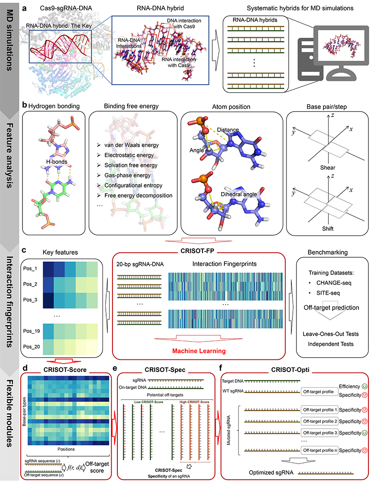

# CRISOT: Genome-wide CRISPR off-target prediction and optimization based on RNA-DNA interaction fingerprints

Read [CRISOT paper](https://www.nature.com/articles/s41467-023-42695-4) via [https://www.nature.com/articles/s41467-023-42695-4](https://www.nature.com/articles/s41467-023-42695-4)

✨The web server of CRISOT is now available at [CRISOT web server](https://crisot.aigene.org.cn/) (https://crisot.aigene.org.cn/).

🚗The CRISOT suite is also available via [zenodo.8422214](https://doi.org/10.5281/zenodo.8422214).


## Introduction

The powerful CRISPR-Cas9 genome editing system is hindered by its off-target effects. Although in silico tools have been developed for single-strand guide RNA (sgRNA) design and CRISPR off-target evaluation, the genome-wide CRISPR off-target prediction performance is limited. In this study, we proposed that the modelling of molecular interactions within the Cas9-sgRNA-DNA complex can substantially improve the genome-wide off-target prediction. To this end, we systematically performed molecular dynamics (MD) simulations to capture the molecular interaction features of the CRISPR-Cas9 system. CRISOT, which is a powerful tool package suite that contains various modules for genome-wide CRISPR off-target evaluation and sgRNA optimization, is presented.



In the CRISOT suite, CRISOT-FP was designed as the fingerprint of an sgRNA-DNA pair encoded by molecular interaction features, and an XGBoost (XGB) model trained with CRISOT-FP surpassed the state-of-the-art off-target prediction methods. Furthermore, CRISOT-Score was designed by using key interaction features identified from CRISOT-FP and has obtained great results in scoring off-target sites and distinguishing active off-targets from inactive ones. Then, CRISOT-Spec was designed to intuitively evaluate the off-target specificity of an sgRNA. Finally, CRISOT-Opti was designed for sgRNA optimization by ingeniously introducing a mutation to the sgRNA to reduce the off-target effect while maintaining efficient on-target effect.

* **CRISOT-FP**: Molecular interaction fingerprint for developing prediction models for CRISPR off-target effects. Users can use the trained models in [models](models) to predict CRISPR-Cas9 off-target effects.
* **CRISOT-Score**: Key interaction features were derived to develop CRISOT-Score, an efficient off-target scoring function to evaluate off-target effects.
* **CRISOT-Spec**: CRISOT-Spec is used to evaluate the off-target specificity of a given sgRNA.
* **CRISOT-Opti**: CRISOT-Opti is used for sgRNA optimization, which smartly introduces a single nucleotide mutation for the given sgRNA by reducing the off-target effect of the given sgRNA while maintaining its on-target effect.

Collectively, the CRISOT suite provides an accurate and comprehensive evaluation of genome-wide CRISPR off-target effects, as well as an efficient way to optimize a given sgRNA for improved off-target specificity in CRISPR genome editing.

## Dependencies

* Python3
  * xgboost==1.7.3
  * pandas
  * numpy
* Reference genome file (Can be downloaded from the [UCSC website](https://hgdownload.soe.ucsc.edu/downloads.html), hg38 is recommended)
* [Cas-OFFinder==2.4](http://www.rgenome.net/cas-offinder/portable)
* GPU acceleration (Recommended)

## Setting up

1. Create a python3 environment
2. Install required python libraries
3. Download and install [Cas-OFFinder](http://www.rgenome.net/cas-offinder/portable). NOTE: Properly set the environment variables to make Cas-OFFinder available.
4. Download genome reference file from the [UCSC website](https://hgdownload.soe.ucsc.edu/downloads.html) and uncompress it to data/. (e.g., data/hg38.fa).
5. Unzip the [trained models](models/trained_models.zip) to [models/](models/) (Required only when using the CRISOT-FP prediction)

## Usage

CRISOT suite includes several methods for off-target prediction and sgRNA optimization:

1. **score**: CRISOT-Score of sgRNA-DNA, requires [--sgr, --tar];
2. **scores**: Batch calculation of CRISOT-Score, requires [--csv], options [--on_item, --off_item, --out];
3. **spec**: Calculate CRISOT-Spec, on-target sequence must be in the first line, requires [--csv], options [--on_item, --off_item];
4. **off_spec**: Perform Cas-Offinder search and calculate CRISOT-Spec, requires [--sgr, --tar, --genome], options [--mm, --dev];
5. **rescore**: Rescoring sgRNAs by CRISOT-Score and CRISOT-Spec, requires [--txt, --genome], options [--mm, --dev, --out];
6. **opti**: CRISOT-Opti optimization by mutation, requires [--tar, --genome], options [--threshold, --mm, --dev, --out];
7. **crisot_fp**: CRISOT-FP XGBoost machine learning prediction, requires [--csv], options [--xgb_model, --out, --on_item, --off_item]
8. **gen_fp**: Generates the fingerprints for a given sgRNA-DNA pair, requires [--sgr, --tar], options [--out]

### score

Calculates the CRISOT-Score score of a given pair of sgRNA-DNA, e.g.,

```bash

python CRISOT.py score --sgr GAGTCCGAGCAGAAGAAGAANGG --tar GAGTCCGAGCAGAAGAAGAANGG

# output:
CRISOT-Score: 
0.9473928688501404
```

```bash

python CRISOT.py score --sgr GAGTCCGAGCAGAAGAAGAANGG --tar GAGTCCGAGGAGAAGACGAAGGG

# output:
CRISOT-Score: 
0.6892195294509914

```

NOTE: sgRNA and target sequences should be 23-nt, with NGG PAM.

### scores

Calculates CRISOT-Score scores of a series of sgRNA-DNA sequences in a csv file, e.g.,

```bash

python CRISOT.py scores --csv example/example.csv --out example/CRISOT-Score_example_out.csv

# output CRISOT-Score scores in file example/CRISOT-Score_example_out.csv

```

NOTE: The default column names of the input csv file are 'On' and 'Off' for sgRNA and target DNA sequences, respectively.

### spec

Given a series of off-target sequences of a specific sgRNA, *spec* calculates the CRISOT-Spec score, e.g.,

```bash

python CRISOT.py spec --csv example/example.csv

# output:
CRISOT-Spec: 
0.8296024039222938

```

NOTE: Off-target sequences in the csv file should be of the same sgRNA. On-target sequence must be in the first line.

### off_spec

Given an sgRNA and its on-target sequence, *off_spec* searches for the genome-wide off-target sites and calculates the CRISOT-Spec score, e.g.,

```bash

python CRISOT.py off_spec --sgr GAGTCCGAGCAGAAGAAGAANGG --tar GAGTCCGAGCAGAAGAAGAAGGG --genome data/test_genome.fa

# output:
CRISOT-Spec: 
0.912578202248319

```

NOTE: 1. Use the proper genome reference file. 2. Change the *--dev* if CUDA error occurs.

### rescore

Rescoring and reranking the designed sgRNAs using the CRISOT-Score and CRISOT-Spec, e.g.,

```bash

python CRISOT.py rescore --txt example/example_sgRNAs.txt --genome data/test_genome.fa --out example/CRISOT_rescore_example_out.csv

# output rescoring results in file example/CRISOT_rescore_example_out.csv

```

NOTE: The input tsv file should contain sgRNA sequences in the 'Target sequence' column.

### opti

Optimizes a given sgRNA by smartly mutating the sgRNA, e.g.,

```bash

python CRISOT.py opti --tar GAGTCCGAGGAGAAGACGAAGGG --genome data/test_genome.fa --out example/CRISOT-Opti_example_out.csv

# output optimization results: example/CRISOT-Opti_example_out.csv

```

NOTE: The default CRISOT-Score threshold for the mutated sgRNAs is 0.8.

### crisot_fp

Evaluates the off-target effects using the XGBoost models trained using the CRISOT-FP, e.g.,

```bash

python CRISOT.py crisot_fp --csv example/example.csv --out example/CRISOT-FP_example_out.csv

# output CRISOT-FP results: example/CRISOT-FP_example_out.csv

```

NOTE & IMPORTANT: The trained XGBoost models are in [models](models/), please UNZIP them before using the *crisot_fp*.
The training and testing datasets used in this study are available via [zenodo.8420032](https://doi.org/10.5281/zenodo.8420032).

### gen_fp

Generates the CRISOT-FP encoding results of a given pair of sgRNA-DNA, e.g.,

```bash

python CRISOT.py gen_fp --sgr GAGTCCGAGCAGAAGAAGAANGG --tar GAGTCCGAGCAGAAGAAGAANGG --out example/CRISOT-FP_example_encoding.csv

# output CRISOT-FP encoding features: example/CRISOT-FP_example_encoding.csv

```

## License

The CRISOT suite is licensed under the creative commons license CC BY-NC2.0 (https://creativecommons.org/licenses/by-nc/2.0/).
The authors have filed a patent application on CRISOT.
The paper is published on [Nature Communications](https://www.nature.com/articles/s41467-023-42695-4).
